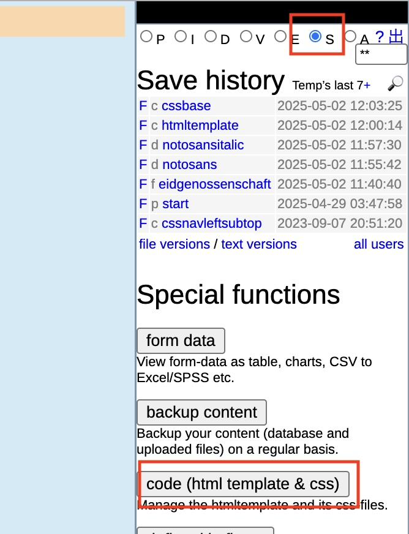

# eIAM Frontend Migration

## How to run this project
### Run u5CMS

1. Clone u5cms, configured as a git submodule. This command will clone the u5CMS repo (https://github.com/u5cms/u5cms.git) into the `u5cms` folder.
```
git submodule update --init --recursive
```
2. Run `docker compose -f local.docker-compose.yml up -d`
3. Go to http://localhost:8080/u5admin/
4. Login with user `Temp`, password `FirstPassword7`

### Insert updated HTML and CSS
1. Run `npm i` and `npm run build`
2. In the admin dashboard, select mode "S" on the right sidebar, and click "code"

3. Select template `cssbase`, and paste content of file `r/cssbase.css` in this project and save.
4. Select template `htmltemplate`, and paste content of file `htmltemplate.html` in this project and save.

### Upload font and logo
#### Upload font
The client would like the font to be hosted internally. So we upload it using the u5CMS admin UI.


1. Go to the u5CMS instance and login 
2. Use this [instruction](https://yuba.ch/r/u5cmsmanualenglisch/u5cmsmanualenglisch_en.pdf#page=23) to upload the file `notosans_de.ttf` to the u5CMS instance
    - At step 3 in the instruction above, type in name `notosans` (instead of "cookbook")
    - Complete to step 4, upload file `r/notosans/notosans_de.ttf` as the German version of the file, no other versions is needed, they will all use this one.

#### Upload logo file
Please go through this [instruction](https://yuba.ch/r/u5cmsmanualenglisch/u5cmsmanualenglisch_en.pdf#page=15) to upload the logo.
1. At step 2 in the instruction above, click "show free images". The panel title should now be "free Images". This step is necessary because the default "std Images" mode will not allow SVGs.
2. At step 3, type in `eidgenossenschaft` for the name.
3. Complete to step 4, upload file `r/eidgenossenschaft/eidgenossenschaft_de.svg` as the German version of the file, no other versions is needed, they will all use this one.

All done, now your frontpage should look like http://eiam.deepsel.com/

## Build Modes

This project supports two distinct build modes, each optimized for different deployment scenarios:

### Regular Build Mode
**Command:** `npm run build:regular`

The regular build mode is designed for traditional u5CMS integration where React components are embedded within the existing u5CMS template system.

**Process:**
1. Builds React application using standard Vite configuration with `src/main.jsx` as entry point
2. Generates separate CSS and JavaScript assets in the `dist` directory
3. Executes post-build script (`merge-built-files.js`) to inline JavaScript into HTML
4. Minifies and optimizes JavaScript code with Terser
5. Injects cssbase.css link reference into the HTML template
6. Removes external JavaScript files, creating a self-contained HTML file


### Universal Build Mode
**Command:** `npm run build` or `npm run build:universal`

The universal build mode creates a standalone JavaScript bundle that can be embedded in any web environment without external dependencies.

**Process:**
1. Builds React application using `src/main.universal.jsx` as entry point
2. Detects u5admin preview mode and skips React initialization
3. Bundles all dependencies into a single IIFE (Immediately Invoked Function Expression)
4. Inlines all CSS styles directly into the JavaScript bundle
5. Implements server-side element hiding logic to prevent rendering conflicts
6. Creates DOM observers to handle dynamic content changes
7. Generates a single `app-universal.js` file with no external dependencies

## Deployment

**Step 1: Create JavaScript Container File (One-time Configuration)**
1. Navigate to `/u5admin` in your u5CMS instance
2. Select mode "S" from the right sidebar, then click "Code (html template & css)"
3. Click "New" to create a new file
4. Name the file `jsreactapp` and click "insert new file"


**Step 2: Update HTML Template (One-time Configuration)**
1. In the same u5admin interface, select the `htmltemplate` file
2. Copy the content from `htmltemplate.external-react.html` in this project
3. Paste it into the `htmltemplate` file and save

*Note: The `htmltemplate.external-react.html` file contains the original HTML template with an additional script tag to load the React application.*

**Step 3: Deploy Updates**
For subsequent deployments when React source code changes:
1. Run `npm run build` to generate the universal build
2. Copy the JavaScript code from `dist/app-universal.iife.js`
3. Paste the code into the `jsreactapp` file in u5admin and save
 